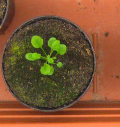

# Semantic Instance Segmentation with a Discriminative Loss Function

This repository implements [Semantic Instance Segmentation with a Discriminative Loss Function](https://arxiv.org/abs/1708.02551) with some enhancements.

* Reference paper does not predict semantic segmentation mask, instead it uses ground-truth semantic segmentation mask. This code predicts semantic segmentation mask, similar to [Towards End-to-End Lane Detection: an Instance Segmentation Approach](https://arxiv.org/abs/1802.05591).
* Reference paper predicts the number of instances implicity. It predicts embeddings for instances and predicts the number of instances as a result of clustering. Instead, this code predicts the number of instances as an output of network.
* Reference paper uses a segmentation network based on [ResNet-38](https://arxiv.org/abs/1512.03385). Instead, this code uses either [ReSeg](https://arxiv.org/abs/1511.07053) with skip-connections based on first seven convolutional layers of [VGG16](https://arxiv.org/abs/1409.1556) as segmentation network or an augmented version of [Stacked Recurrent Hourglass](https://arxiv.org/abs/1806.02070).
* This code uses [KMeans Clustering](http://scikit-learn.org/stable/modules/generated/sklearn.cluster.KMeans.html#sklearn.cluster.KMeans); however, reference paper uses "a fast variant of the mean-shift algorithm".

----------------------------

## Modules

* [Convolutional GRU](code/lib/archs/modules/README.md#3)
* [Coordinate Convolution](code/lib/archs/modules/README.md#44)
	* [AddCoordinates](code/lib/archs/modules/README.md#44)
	* [CoordConv](code/lib/archs/modules/README.md#81)
	* [CoordConvTranspose](code/lib/archs/modules/README.md#112)
	* [CoordConvNet](code/lib/archs/modules/README.md#145)
* [Recurrent Hourglass](code/lib/archs/modules/README.md#187)
* [ReNet](code/lib/archs/modules/README.md#225)
* [VGG16](code/lib/archs/modules/README.md#258)
	* [VGG16](code/lib/archs/modules/README.md#258)
	* [SkipVGG16](code/lib/archs/modules/README.md#304)

## Networks

* [ReSeg](code/lib/archs/README.md#3)
* [Stacked Recurrent Hourglass](code/lib/archs/README.md#47)

----------------------------

In prediction phase, network inputs an image and outputs a semantic segmentation mask, the number of instances and embeddings for all pixels in the image. Then, foreground embeddings (which correspond to instances) are selected using semantic segmentation mask and foreground embeddings are clustered into "the number of instances" groups via clustering.

# Installation

* Clone this repository : `git clone --recursive https://github.com/Wizaron/instance-segmentation-pytorch.git`
* Install ImageMagick : `sudo apt install imagemagick`
* Download and install [Anaconda](https://www.anaconda.com/download/) or [Miniconda](https://conda.io/miniconda.html)
* Create a conda environment : `conda env create -f instance-segmentation-pytorch/code/conda_environment.yml`

## Data

### CVPPP

* Download [CVPPP dataset](https://www.plant-phenotyping.org/datasets-download) and extract downloaded zip file (`CVPPP2017_LSC_training.zip`) to `instance-segmentation-pytorch/data/raw/CVPPP/`
*  This work uses *A1* subset of the dataset.

## Code Structure

* **code**: Codes for training and evaluation.
	* **lib**
		* **lib/archs**: Stores network architectures.
		* **lib/archs/modules**: Stores basic modules for architectures.
		* **lib/model.py**: Defines model (optimization, criterion, fit, predict, test, etc.).
		* **lib/dataset.py**: Data loading, augmentation, minibatching procedures.
		* **lib/preprocess.py**, **lib/utils**: Data augmentation methods.
		* **lib/prediction.py**: Prediction module.
		* **lib/losses/dice.py**: Dice loss for foreground semantic segmentation.
		* **lib/losses/discriminative.py**: [Discriminative loss](https://arxiv.org/pdf/1708.02551.pdf) for instance segmentation.
	* **settings**
		* **settings/CVPPP/data_settings.py**: Defines settings about data.
		* **settings/CVPPP/model_settings.py**: Defines settings about model (hyper-parameters). 
		* **settings/CVPPP/training_settings.py**: Defines settings for training (optimization method, weight decay, augmentation, etc.).
	* **train.py**: Training script.
	* **pred.py**: Prediction script for single image.
	* **pred_list.py**: Prediction scripts for a list of images.
	* **evaluate.py**: Evaluation script. Calculates SBD (symmetric best dice), |DiC| (absolute difference in count) and Foreground Dice (Dice score for semantic segmentation) as defined in the [paper](http://eprints.nottingham.ac.uk/34197/1/MVAP-D-15-00134_Revised_manuscript.pdf).
* **data**:  Stores data and scripts to prepare dataset for training and evaluation.
	* **metadata/CVPPP**: Stores metadata; such as, training, validation and test splits, image shapes etc.
	* **processed/CVPPP**: Stores processed form of the data.
	* **raw/CVPPP**: Stores raw form of the data.
	* **scripts**: Stores scripts to prepare dataset.
		* **scripts/CVPPP**: For CVPPP dataset.
			* **scripts/CVPPP/1-create_annotations.py**: Saves annotations as a numpy array to `processed/CVPPP/semantic-annotations/` and `processed/CVPPP/instance-annotations`.
			* **scripts/CVPPP/1-remove_alpha.sh**: Removes alpha channels from images. (In order to run this script, `imagemagick` should be installed.).
			* **scripts/CVPPP/2-get_image_means-stds.py**: Calculates and prints channel-wise means and standard deviations from training subset.
			* **scripts/CVPPP/2-get_image_shapes.py**:  Saves image shapes to `metadata/CVPPP/image_shapes.txt`.
			* **scripts/CVPPP/2-get_number_of_instances.py**: Saves the number of instances in each image to `metadata/CVPPP/number_of_instances.txt`.
			* **scripts/CVPPP/2-get_image_paths.py**: Saves image paths to `metadata/CVPPP/training_image_paths.txt`, `metadata/CVPPP/validation_image_paths.txt`
			* **scripts/CVPPP/3-create_dataset.py**: Creates an lmdb dataset to `processed/CVPPP/lmdb/`.
                        * **scripts/CVPPP/prepare.sh**: Runs the scripts above in a sequential manner.
* **models/CVPPP**: Stores checkpoints of the trained models.
* **outputs/CVPPP**: Stores predictions of the trained models.

## Data Preparation

Data should be prepared prior to training and evaluation.

* Activate previously created conda environment : `source activate ins-seg-pytorch` or `conda activate ins-seg-pytorch`

### CVPPP

* Place the extracted dataset to `instance-segmentation-pytorch/data/raw/CVPPP/`. Hence, raw dataset should be found at `instance-segmentation-pytorch/data/raw/CVPPP/CVPPP2017_LSC_training/`.
* In order to prepare the data go to `instance-segmentation-pytorch/data/scripts/CVPPP/` and run `sh prepare.sh`.

## Visdom Server

Start a [Visdom](https://github.com/facebookresearch/visdom) server in a `screen` or `tmux`.

* Activate previously created conda environment : `source activate ins-seg-pytorch` or `conda activate ins-seg-pytorch`

* Start visdom server : `python -m visdom.server`

* We can access visdom server using `http://localhost:8097`

## Training

* Activate previously created conda environment : `source activate ins-seg-pytorch` or `conda activate ins-seg-pytorch`

* Go to `instance-segmentation-pytorch/code/` and run `train.py`.

```
usage: train.py [-h] [--model MODEL] [--usegpu] [--nepochs NEPOCHS]
                [--batchsize BATCHSIZE] [--debug] [--nworkers NWORKERS]
                --dataset DATASET

optional arguments:
  -h, --help            show this help message and exit
  --model MODEL         Filepath of trained model (to continue training)
                        [Default: '']
  --usegpu              Enables cuda to train on gpu [Default: False]
  --nepochs NEPOCHS     Number of epochs to train for [Default: 600]
  --batchsize BATCHSIZE
                        Batch size [Default: 2]
  --debug               Activates debug mode [Default: False]
  --nworkers NWORKERS   Number of workers for data loading (0 to do it using
                        main process) [Default : 2]
  --dataset DATASET     Name of the dataset which is "CVPPP"
```

Debug mode plots pixel embeddings to visdom, it reduces size of the embeddings to two-dimensions using [TSNE](http://scikit-learn.org/stable/modules/generated/sklearn.manifold.TSNE.html). Hence, it slows training down.

As training continues, models are saved to `instance-segmentation-pytorch/models/CVPPP`.

## Evaluation

After training is completed, we can make predictions.

* Activate previously created conda environment : `source activate ins-seg-pytorch` or `conda activate ins-seg-pytorch`

* Go to `instance-segmentation-pytorch/code/`.
* Run `pred_list.py`.

```
usage: pred_list.py [-h] --lst LST --model MODEL [--usegpu]
                    [--n_workers N_WORKERS] --dataset DATASET

optional arguments:
  -h, --help            show this help message and exit
  --lst LST             Text file that contains image paths
  --model MODEL         Path of the model
  --usegpu              Enables cuda to predict on gpu
  --dataset DATASET     Name of the dataset which is "CVPPP"
```

For example: `python pred_list.py --lst ../data/metadata/CVPPP/validation_image_paths.txt  --model ../models/CVPPP/2018-3-4_16-15_jcmaxwell_29-937494/model_155_0.123682662845.pth --usegpu --n_workers 4 --dataset CVPPP`

* Predictions are written to `outputs` directory.
* After prediction is completed we can run `evaluate.py`. It prints output metrics to the stdout.

```
usage: evaluate.py [-h] --pred_dir PRED_DIR --dataset DATASET

optional arguments:
  -h, --help           show this help message and exit
  --pred_dir PRED_DIR  Prediction directory
  --dataset DATASET    Name of the dataset which is "CVPPP"
```

For example: `python evaluate.py --pred_dir ../outputs/CVPPP/2018-3-4_16-15_jcmaxwell_29-937494-model_155_0.123682662845/validation/ --dataset CVPPP`

## Prediction

After training is complete, we can make predictions. We can use `pred.py` to make predictions for a single image.

* Activate previously created conda environment : `source activate ins-seg-pytorch` or `conda activate ins-seg-pytorch`

* Go to `instance-segmentation-pytorch/code/`.
* Run `pred.py`.

```
usage: pred.py [-h] --image IMAGE --model MODEL [--usegpu] --output OUTPUT
               [--n_workers N_WORKERS] --dataset DATASET

optional arguments:
  -h, --help            show this help message and exit
  --image IMAGE         Path of the image
  --model MODEL         Path of the model
  --usegpu              Enables cuda to predict on gpu
  --output OUTPUT       Path of the output directory
  --dataset DATASET     Name of the dataset which is "CVPPP"
```

## Results

### CVPPP

#### Scores on validation subset (28 images)

| SBD           | \|DiC\|       | Foreground Dice  |
|:-------------:|:-------------:|:----------------:|
| 87.9          | 0.5           | 96.8             |

#### Sample Predictions

  
  
  

# References

* [VERY DEEP CONVOLUTIONAL NETWORKS FOR LARGE-SCALE IMAGE RECOGNITION](https://arxiv.org/abs/1409.1556)
* [ReNet: A Recurrent Neural Network Based Alternative to Convolutional Networks](https://arxiv.org/abs/1505.00393)
* [DELVING DEEPER INTO CONVOLUTIONAL NETWORKS FOR LEARNING VIDEO REPRESENTATIONS](https://arxiv.org/abs/1511.06432)
* [ReSeg: A Recurrent Neural Network-based Model for Semantic Segmentation](https://arxiv.org/abs/1511.07053)
* [Semantic Instance Segmentation with a Discriminative Loss Function](https://arxiv.org/abs/1708.02551)
* [Instance Segmentation and Tracking with Cosine Embeddings and Recurrent Hourglass Networks](https://arxiv.org/abs/1806.02070)
* [An intriguing failing of convolutional neural networks and the CoordConv solution](https://arxiv.org/abs/1807.03247)
* [Leaf segmentation in plant phenotyping: A collation study](http://eprints.nottingham.ac.uk/34197/1/MVAP-D-15-00134_Revised_manuscript.pdf)
